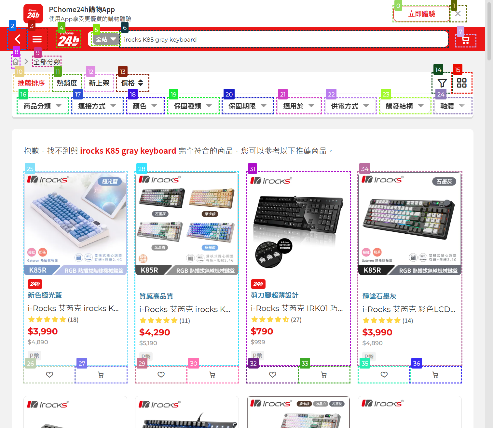
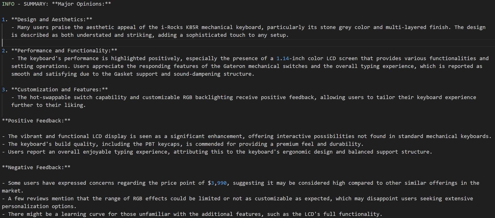
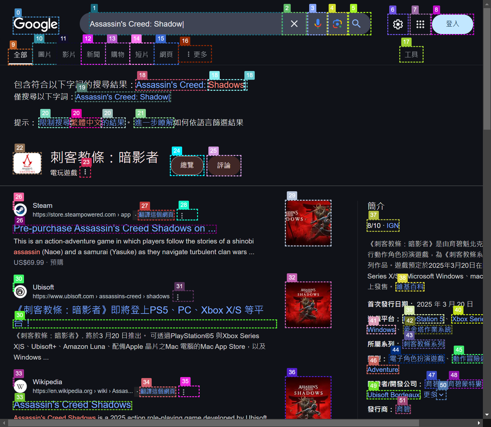
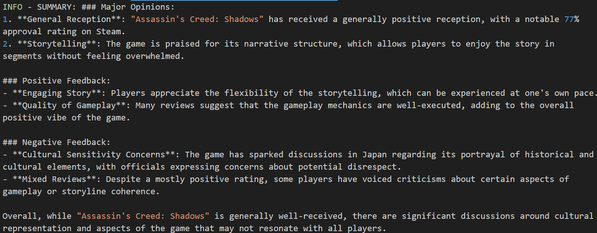
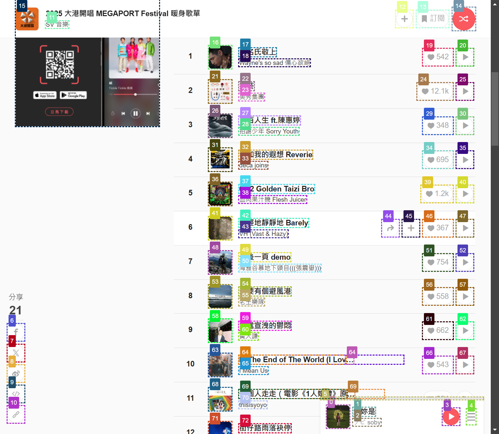

## Assignment 1 - Reflexive Web Agent with Tools Use ##
> [!note]
> **核心功能：**<br>
> (1) 新增LLM-Reviewer對Agent輸出做初步審查，當可行性低時重新生成操作<br>
> (2) 新增Summary動作，輸出Answer後會使用答案做搜尋並針對網路結果做正負面總結<br>
>
> [我的Repo Link - hertz39xx/AgenticAI_Assignment_1](https://github.com/hertz39xx/AgenticAI_Assignment_1)
> 
**Assigment description:** Please implement an Agentic AI system focusing on tool usage and planning capabilities. Your solution should demonstrate the ability to interact with web environments and execute tasks effectively.<br>
This assisgment is edited from [WebVoyager](https://github.com/MinorJerry/WebVoyager)🫡

## Setup Environment ##
For this project, you need a environment with <code>python=3.10</code>

For setup env, please do:
```
$ conda create -n webvoyager python=3.10
$ conda activate webvoyager
$ pip install -r requirements.txt
```

## Quick Start ## 
First, you need create new file <code>.env</code>, which include:
```
OPENAI_API_KEY = 'YOUR_API_KEY_HERE'
```

Then, you can start this project successfully!
```
$ python run.py
```

## Project introduction ##
**Scenario:** </br>
This is an automated information retrieval and summarization Agentic AI which can help users to obtain key information more efficiently. It’s designed for users who need to quickly acquire and organize information.

**Hoping to solving:**</br>
1.	The time-consuming manual searching work.
2.	Messy and unstructured information sources.

**Core cycle process of Agent:** </br>
- **Environment**
1.	Webpage Data Extraction: Using selenium webdrive to open target website, then using rectangles to mark all the elements’ position and taking a screenshot for later usage.
- **Perception**
1.	According to the screenshot, convert it into base64 and provide the elements to LLM, let it analysis the webpage.
- **Brain**
1. According to the task requirement, LLM will think what element it should interact with to achieve the goal. It will generate the ‘thought’ and ‘action’ based on the prompts and image we gave to it.
1. Then another LLM ‘Reviewer’ will judge the thought and action based on the task. If it think it’s not feasible, then it will provide the reason to the first LLM and make it re-generate thought and action.
- **Action**
1. After get the thought and action, the program will interact will the element LLM chosen. Repeat the loop from environment to action, until the LLM output the label ‘ANSWER’, which means the task is completed.
2. After got the answer, this agent will using the answer to do a search query, then generating a summary which contain positive and negative feedback and finish this task.
---
## Interact between two-LLM (Agent & Reviewer)

### For example, in the log you can see the process of interaction. The Reviewer will give opinion (Feasibile/Not Feasible) and some reason/suggestion to agent.

### Back to <code>run.py</code>, when reviewer return "Not feasible" it will go to the part which ask the agent re-generate.

## Test Cases ###
### 1. Search the price and product name for the iRocks K85 keyboard(Gray) on PChome.
```
{"web_name": "pchome", "id": "pchome--0", "ques": "Find irocks k85 on pchome. And make sure the color of keyboard is gray. Give the price and name.", "web": "https://24h.pchome.com.tw/"}
```


**Example summary:**

### Results: Successfully searched for iRocks K85 keyboard. But occasionally failed to generated summary correctly, due to the answer’s content.

### 2. Use Google to search for the English name, release date, and publisher of《刺客教條：暗影者》.
```
{"web_name": "google_search", "id": "google_search_task--0", "ques": "Find 《刺客教條：暗影者》's english name, publish date and publisher.", "web": "https://google.com"}
```

](results/20250320_13_27_29/taskgoogle_search_task--0/screenshot2.png)

**Example summary:**

### Results: Name, publisher and date and be extract correctly, and generate summary successfully.

### 3. StreetVoice Music Ranking Search
```
{"web_name": "street_voice", "id": "street_voice--0", "ques": "Find the songs ranking, then find the most popular song of this week. And make sure that song has more than 100 likes. ", "web": "https://streetvoice.com/"}
```
](results/20250320_13_29_16/taskstreet_voice--0/screenshot3.png)

**Example summary:**

### Results: Successfully searched for the top song of this week. But occasionally failed to enter the weekly ranking, only stay in the overall ranking.

## Citation
Original paper of Webvoyager:
```
@article{he2024webvoyager,
  title={WebVoyager: Building an End-to-End Web Agent with Large Multimodal Models},
  author={He, Hongliang and Yao, Wenlin and Ma, Kaixin and Yu, Wenhao and Dai, Yong and Zhang, Hongming and Lan, Zhenzhong and Yu, Dong},
  journal={arXiv preprint arXiv:2401.13919},
  year={2024}
}
```